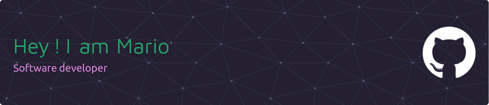

# Hi there! Nice to see you 👋  
### Welcome to my GitHub!

### I'm Mario, a software developer from 🇲🇽 passionate about building clean, efficient and user-friendly applications.

---

## 🧑‍💻 About Me
- 💼 Engineer with 13 years of experience in quality and productivity.
- 🎓 Currently diving deep into **Java, Spring Boot, Django** and **JavaScript (React/Next.js)**.
- 🚀 Actively developing real-world apps like telemedicine systems and POS solutions.
- 🧠 Always learning, improving and sharing knowledge.
- 🌎 Bilingual (Spanish 🇪🇸 / English 🇬🇧)

---

## 🛠️ Tech Stack

---

## 🔥 GitHub Stats

---

## 📌 Featured Projects

- [🩺 Medlife Telemedicine](https://github.com/MarioHMis/medlife) — Java + Spring Boot + MySQL  
- [🐔 Chicken POS](https://github.com/MarioHMis/chicken-pos) — Django + Bootstrap  
- [📝 CLI Task Manager](https://github.com/MarioHMis/cli-task-manager) — Java CLI App using Maven & Gson  

*(Pinea estos proyectos en tu perfil para destacarlos)*

---

## 📫 Let's Connect

- 💼 [LinkedIn](https://www.linkedin.com/in/tu-linkedin)  
- 🌐 [Portfolio Website](https://tu-portfolio.com)  
- 📬 Email: mariohmis@example.com

---

_Thanks for stopping by! Keep building and stay curious._
